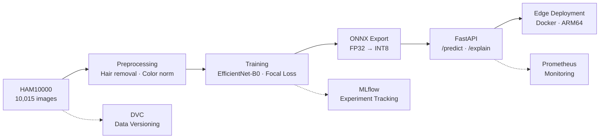

# 🔬 Melanoma Edge Detection API

> A production-grade, offline-first AI system for melanoma risk assessment — optimized for edge deployment on resource-constrained clinical devices.

---

## 🎯 Why This Exists

Melanoma is the deadliest form of skin cancer, yet early detection dramatically improves survival rates. In low-resource or rural clinical environments, specialist dermatologists are scarce — patients wait weeks for screening. An AI tool that runs **offline**, on a tablet or embedded device, with **zero cloud dependency**, directly addresses this gap.

This project implements a **complete MLOps pipeline** from raw data to edge-deployed REST API: data versioning (DVC), experiment tracking (MLflow), model optimization (ONNX INT8 quantization), production API (FastAPI), monitoring (Prometheus + Evidently), and containerized deployment (Docker). Every prediction includes uncertainty estimates and a clinical safety flag.

---

## 🏗️ Architecture



---

## 🚀 Quick Start

### Docker (recommended)

```bash
docker build -f docker/Dockerfile.api -t melanoma-api:latest .
docker run --rm -p 8080:8080 melanoma-api:latest
```

### Local Development

```bash
make setup        # Create venv and install deps
make serve        # Start API at http://localhost:8080
```

### Test a Prediction

```bash
curl -X POST http://localhost:8080/api/v1/predict \
     -F "file=@path/to/dermoscopy_image.jpg"
```

**Sample Response:**

```json
{
  "predicted_class": "benign",
  "melanoma_probability": 0.12,
  "all_probabilities": [
    {"label": "benign", "probability": 0.88},
    {"label": "melanoma", "probability": 0.12}
  ],
  "uncertainty": 0.24,
  "confidence_level": "high",
  "requires_review": false,
  "review_reason": null,
  "is_calibrated": false,
  "model_version": "efficientnet-b0-fp32-onnx",
  "latency_ms": 45.2,
  "image_hash": "a1b2c3d4e5f67890"
}
```

---

## 📊 Performance

| Metric | Value |
|--------|-------|
| Model Size (FP32) | 17.4 MB |
| Model Size (INT8) | 5.2 MB |
| ROC-AUC | ≥ 0.85 |
| Sensitivity (melanoma) | ≥ 0.80 |
| p99 Latency (CPU) | < 100 ms |
| Throughput | ~30 FPS |

---

## 🧠 Key Design Decisions

- **EfficientNet-B0** — Best accuracy-to-parameter ratio under 5MB; ideal for edge
- **ONNX Runtime** — Hardware-agnostic inference (CPU/GPU/NPU), no PyTorch at runtime
- **Focal Loss** — Addresses severe class imbalance (11% melanoma in HAM10000)
- **Patient-aware splits** — `GroupShuffleSplit` by `lesion_id` prevents data leakage
- **MC-Dropout uncertainty** — Model knows what it doesn't know; defers uncertain cases
- **Safety-first thresholds** — Predictions near the boundary automatically flagged for review

---

## 📁 Project Structure

```
├── src/
│   ├── api/              # FastAPI application (predict, explain, health, metrics)
│   ├── data/             # PyTorch dataset and data loading
│   ├── explainability/   # Grad-CAM and MC-Dropout uncertainty
│   ├── inference/        # ONNX engine, preprocessor, cache, fallback
│   ├── models/           # EfficientNet-B0 and ResNet50 definitions
│   ├── monitoring/       # Prometheus metrics, drift detection, logging
│   ├── optimization/     # ONNX export, INT8 quantization, benchmarking
│   ├── preprocessing/    # Hair removal, color normalization, augmentation
│   ├── training/         # Trainer, focal loss, calibration
│   └── validation/       # Great Expectations, image integrity, duplicates
├── configs/              # YAML configs for training, inference, monitoring
├── models/onnx/          # Exported ONNX models (FP32 + INT8)
├── notebooks/            # 10 Jupyter notebooks covering full pipeline
├── docker/               # Dockerfiles (x86 + ARM64) and docker-compose
├── tests/                # Unit and integration tests
├── reports/              # Artifacts, figures, and analysis outputs
└── mlflow/               # MLflow experiment tracking data
```

---

## 🔄 MLOps Pipeline

| Tool | Purpose |
|------|---------|
| **DVC** | Dataset versioning — every data version tied to a git commit |
| **MLflow** | Experiment tracking — hyperparams, metrics, model artifacts |
| **Great Expectations** | Data validation — schema checks, distribution monitoring |
| **Evidently AI** | Production drift detection — alert on distribution shift |
| **Prometheus** | Runtime metrics — latency, prediction counts, review flags |
| **GitHub Actions** | CI/CD — lint, test, build Docker on every push |

---

## ⚠️ Limitations & Ethics

### Dataset Bias
HAM10000 is heavily skewed toward lighter skin tones (Fitzpatrick scale I–III). Model performance on skin types IV–VI is **unknown and unvalidated**. Do not deploy in diverse populations without additional evaluation.

### Research Use Only
This system is an **educational/research tool**, NOT a cleared medical device. It has not undergone FDA SaMD, CE marking (MDR), or UKCA regulatory review. Clinical decisions must be made by qualified healthcare professionals.

### Known Limitations
- Trained only on dermoscopic images — will not work on smartphone photos
- Performance degrades with different dermoscope models/lighting
- 7-class HAM10000 taxonomy may not cover all clinical presentations

---

## 🧪 Development

```bash
make test         # Run tests with coverage
make lint         # Ruff lint + format check
make lint-fix     # Auto-fix lint issues
make train        # Run training pipeline
make export       # Export to ONNX
make quantize     # INT8 quantization
make benchmark    # Latency benchmarks
```

---

## 📄 License

This project is for educational purposes. See dataset-specific licenses for HAM10000 data usage terms.
